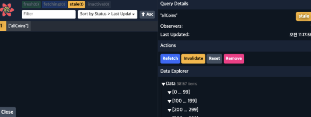

# Type Script With React

## 테마에 타입을 포함시키기

- styled.d.ts 파일 만들기

```JS
import "styled-components";

declare module "styled-components" {

export interface DefaultTheme {

textColor: string;

bgColor: string;

} }
```

스타일 관련한 타입을 만들어준다.

- theme.ts

```JS
import { DefaultTheme } from "styled-components";

export const lightTheme: DefaultTheme = {

bgColor: "yellow",

textColor: "black",

};


export const darkTheme: DefaultTheme = {

bgColor: "black",

textColor: "white",

};

```

타입에 맞는 css 속성을 지정해준다.

- index.tsx

```JS
import React from "react";

import ReactDOM from "react-dom";

import { ThemeProvider } from "styled-components";

import App from "./App";

import { lightTheme, darkTheme } from "./theme";


ReactDOM.render(

<ThemeProvider theme={lightTheme}>

<App />

</ThemeProvider>,

document.getElementById("root")

);

```

- App.tsx

```JS

const Container = styled.div`

background-color: ${(props) => props.theme.bgColor};

`;


const H1 = styled.h1`

color: ${(props) => props.theme.textColor};

`;


function App() {

return (

<Container>

<H1>Protected</H1>

</Container>

);

}

```

이렇게 가져다가 써주면 됨.

---

## Route-States

- parameter 가져오기 = useParams 사용하면 url 뒤의 파라미터 값을 가져올 수있다.

```JS
const params = useParams();
console.log(params);
```

- Link 를 통해 state를 보내기
  Link 를 사용하여 state를 전달할 수있다. (v5 와 v6 에서 문법이 살짝 달라졌음에 유의. )

```JS
<Link
to={{ pathname: `/${coin.id}`, state: { name: coin.name } }} >
```

[리액트 라우터 돔](https://reactrouter.com/docs/en/v6/upgrading/v5#use-usenavigate-instead-of-usehistory)

- Link 를 통해 전달한 state를 사용하기
  react router DOM 이 보내주는 location object 에 접근하여 값을 가져오는 방법
  useLocation 훅을 사용하여 전달받는 state를 받아서 사용할 수있다.

```JS
const { state } = useLocation<RouteState>();
```

JS-Optional Chaining
만약 state가 있으면? name을 가져오고 없으면 "Loading" 을 띄운다.

```JS
{state?.name || "Loading"}
```

---

## Nested Routes

nested route 는 route 안에 있는 또 다른 route 로 탭을 사용할때 매우 유용함. 혹은 스크린 안에 많은 섹션이 나뉘어진 곳에서도 유용하다.

1. Switch 를 사용하여 두개의 route를 렌더할 수있게 한다.
2. route를 만든다.
3. route에 path를 부여한다.

### Tab 만들기

1. 탭을 누르면 링크로 이동하게 만든다.

```JS
<Tabs>

<Tab>

<Link to={`/${coinId}/chart`}>Chart</Link>

</Tab>

<Tab>

<Link to={`/${coinId}/price`}>Price</Link>

</Tab>

</Tabs>
```

onClick event 없이 `Link` 를 사용하여 URL을 변경해준다.

2. 탭 선택을 알아채기

- #useRouteMatch 훅을 사용하여 유저가 어느 탭에 있는지 식별하기
- useRouteMath를 사용하여 특정 URL에 있는지 여부를 알 수있다.

```JS
const priceMatch = useRouteMatch("/:coinId/price");
```

를 사용하면 다음과 같은 정보를 반환 해준다.
![[Pasted image 20220308213842.png]]

```JS
<Tab isActive={chartMatch !== null}>
	<Link to={`/${coinId}/chart`}>Chart</Link>
</Tab>
```

useRouteMatch 를 사용하여 위처럼 props 조건처리가 가능하다.

```JS
const Tab = styled.span<{ isActive: boolean }>`
```

Tab 의 styled-component는 boolean형의 isActive 프롭을 가지고 isActive 값이 true, false 일때 조건을 처리할 수있다.

---

## React Query

`npm i react-query ` -[리액트 쿼리 공식문서](https://react-query.tanstack.com/quick-start) -[참고 링크 ](https://www.js2uix.com/frontend/react-query-step1/)

> React 앱에서 비동기 로직을 쉽게 다루게 해주는 라이브러리인 React Query를 사용해보자

### React Query 사용이유?

1.  서버 데이터 캐싱
2.  데이터 패칭 시 로딩, 에러 처리를 한 곳에서 처리 가능
3.  prefetching, retry 등 다양한 옵션
4.  쉬운 상태 관리 가능

### React Query 사용하기

1. query Client 만들기

```JS
const queryClient = new QueryClient();
```

3. provider 만들기

```JS
<QueryClientProvider client={queryClient}>
<App />
</QueryClientProvider>,
```

5. fetcher 함수 를 만들어서 데이터를 패칭
   fetcher 함수는 꼭 fetch promise 를 리턴해줘야 한다.

```JS
export function fetchCoins() {
	//json Data 를 리턴 해줘야한다.
	return fetch("https://api.coinpaprika.com/v1/coins").then((response) =>
	response.json()
); }
```

6. useQuery 를 이용하여 데이터를 불러오기

- useQuery hook 을 사용하여 API 데이터의 만료 시간, 리프레싱 주기, 데이터를 캐시에서 유지할 기간, 브라우저 포커스 시 데이터 리프레시 여부, 성공/에러 콜백 등의 기능을 제어할 수 있다.

```JS
const { isLoading, data } = useQuery<CoinInterface[]>("allCoins", fetchCoins);
```

useQuery(쿼리 키, fetcher 함수) 사용하여 isLoading 상태와 위의 fetchCoins에서 리턴한 data 값을 사용하고자 하는 컴포넌트에서 불러와 사용할 수있다.

특이한점은 리프레시하여도 다시 fetch해오지 않는다는 것인데, 이는 데이터를 캐시에 저장하는 react-query의 특징 때문이다.

#### 🤔 만약 두개의 fetch 데이터가 필요할때는 어떻게 react query 를 사용할 수있을까?

```JS
const { isLoading: infoLoading, data: infoData } = useQuery<InfoData>(

["info", coinId],

() => fetchCoinInfo(coinId)

);


const { isLoading: tickerLoading, data: tickerData } = useQuery<PriceData>(

["tickers", coinId],

() => fetchCoinTickers(coinId)

);
```

위와 같이 object 의 property를 가져온 후 이름을 바꾸는 자바스크립트 문법을 사용하여
: 기호 뒤에 다시 이름을 지정해줄 수있다. 또한 key 값이 배열로 저장되기때문에 ["info",coinId] 처럼 이름을 지정해줄 수도 있다.

### React Query Dev tools

> React-query Debug 툴 사용법

- ReactQueryDevtools 를 import 해주고

```JS
import { ReactQueryDevtools } from "react-query/devtools";
```

App.tsx 에 컴포넌트를 추가해주면

```JS
<ReactQueryDevtools initialIsOpen={true} />
```

React-Query Dev tools 를 볼 수있다.

